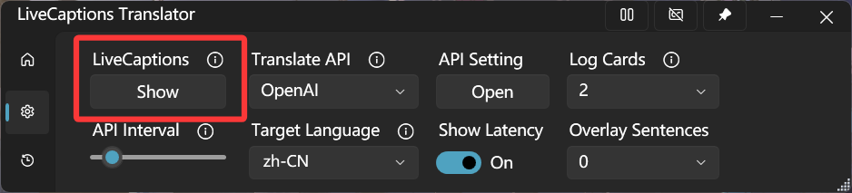
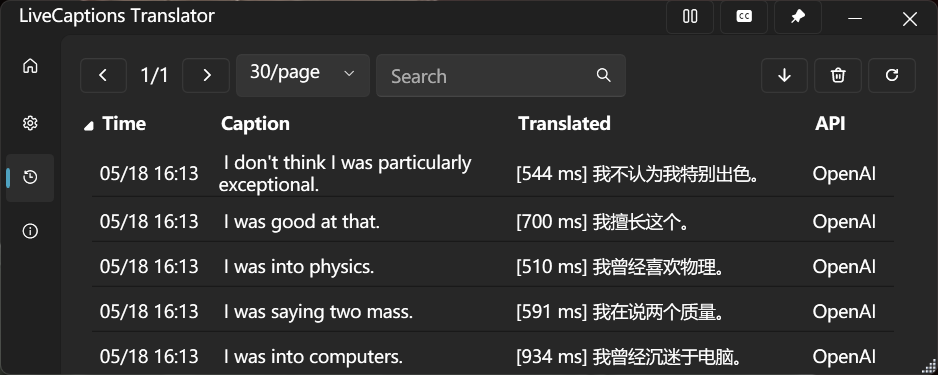
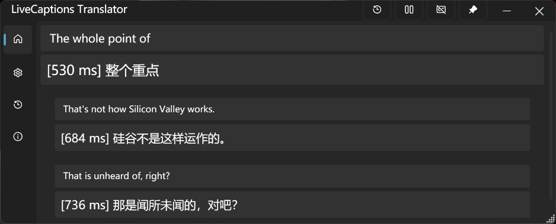



# LiveCaptions Translator

### *Real-time audio/speech translation tool based on Windows LiveCaptions*

**English** | [中文](README_zh-CN.md)

## Overview

**✨ LiveCaptions Translator = Windows LiveCaptions + Translate API ✨**

This is a lightweight tool that seamlessly integrates translation APIs with Windows Live Captions, enabling real-time speech translation without requiring a Copilot+ PC.

Windows' built-in LiveCaptions is easy to use, uses few resources, and has extremely high recognition accuracy. If empowering it with the awesome translation capabilities of LLMs, you will get... possibly the best real-time translator available to date!

**🚀 Quick Start:** Download from [Releases](https://github.com/SakiRinn/LiveCaptions-Translator/releases) and start with a single click!

  
   
  <em style="font-size:80%">Preview of LiveCaptions Translator</em>
   

## Features

- **🔄 Seamless Integration** \
  Automatically invokes Windows LiveCaptions without opening separate windows. Provides a unified experience for real-time audio/speech translation.
  After your first use, Windows LiveCaptions will be hidden by default. You can show it again in the settings.

  

  
   
  <em style="font-size:80%">LiveCaptions Show/Hide button</em>
   
  

  By enabling the ***Include microphone audio option*** in the setting of Windows LiveCaptions, you can achieve real-time speech translation!
  > ⚠️ **IMPORTANT:** You must change the source language in Windows LiveCaptions!

- **🎨 Modern Interface** \
  Easy-to-use and clean Fluent UI aligned with modern Windows aesthetics. It can automatically switches between light and dark themes 🌓 based on the system setting.

- **🌐 Multiple Translation Services** \
  Supports various translation engines, including 2 out-of-the-box Google Translate.
  Implemented translation engines are shown in the table below:

  

  | API                                 | Type        | Hosting     |
  | ----------------------------------- | ----------- | ----------- |
  | [Ollama](https://ollama.com)        | LLM-based   | Self-hosted |
  | OpenAI Compatible API               | LLM-based   | Online      |
  | [OpenRouter](https://openrouter.ai) | LLM-based   | Online      |
  | Google Translate                    | Traditional | Online      |
  | DeepL                               | Traditional | Online      |
  | Youdao                              | Traditional | Online      |
  | Baidu Translate                     | Traditional | Online      |
  | MTranServer                         | Traditional | Self-hosted |

  

  It's strongly recommended using **LLM-based** translation engines, as LLMs excel at handling incomplete sentences and are adept at understanding context.

- **🪟 Overlay Window** \
  Open a borderless, transparent overlay window to display subtitles, providing the most immersive experience. This is very useful for scenarios like gaming, videos, and live streams!
  You can even make it completely embedded into the screen, becoming part of it. This means it won't affect any of your operations at all! This is perfect for gamers.

  

  
   
  <em style="font-size:80%">Overlay window</em>
   
  

  You can open the Overlay Window on the taskbar. You can adjust its parameters such as the window background and subtitle color, font size, and transparency. Extremely high configurability allows it to completely match your preferences!
  You can adjust the number of sentences displayed simultaneously in the *Overlay Sentences* section of the setting page.

- **⚙️ Flexible Controls** \
  Supports Always-on-top window and convenient translation pause/resume, and you can copy text with a single click for quick share or saving.

- **📒 History Management** \
  Records original and translated text, perfect for meetings, lectures, and important discussions.
  You can export all records as a CSV file.

  

  
   
  <em style="font-size:80%">Translation history</em>
   
  

- **🎞️ Log Cards** \
  Recent transcription records can be displayed as Log Cards, which helps you better grasp the context.
  You can enable it on the taskbar of the main page and change the number of cards in the *Log Cards* section of the setting page.

  

  
   
  <em style="font-size:80%">Log Cards</em>
   
  

## Prerequisites

| Requirement                                                                                                           | Details                                     |
| --------------------------------------------------------------------------------------------------------------------- | ------------------------------------------- |
|  | With LiveCaptions support.                  |
|              | Recommended. Not test in previous versions. |

This tool is based on Windows LiveCaptions, which is available since Windows 11 22H2.

We suggest you have .NET runtime 8.0 or higher installed. If you are not available to install one, you can download the ***with runtime*** version but its size is bigger.

  

    
  

## Getting Started

> ⚠️ **IMPORTANT:** You must complete the following steps before running LiveCaptions Translator for the first time.
>
> For detailed information, see Microsoft's guide on [Using live captions](https://support.microsoft.com/en-us/windows/use-live-captions-to-better-understand-audio-b52da59c-14b8-4031-aeeb-f6a47e6055df).

### Step 1: Verify Windows LiveCaptions Availability

Confirm LiveCaptions is available on your system using any of these methods:

- Toggle **Live captions** in the quick settings
- Press **Win + Ctrl + L**
- Access via **Quick settings** > **Accessibility** > **Live captions**
- Open **Start** > **All apps** > **Accessibility** > **Live captions**
- Navigate to **Settings** > **Accessibility** > **Captions** and enable **Live captions**

### Step 2: Setup and Configure LiveCaptions

When you start for the first time, live captions will ask for your consent to process voice data on your device and prompt you to download language files to be used by on-device speech recognition.

After launching Windows LiveCaptions, you can click the **⚙️Gear** icon to open the setting menu.

To enhance your experience with LiveCaptions Translator, we strongly recommend configuring the following settings:

- Select Position > Overlaid on screen. (Importantly)
- Click Caption language > Add a language to add some languages and download all items under Speech Recognition in ··· Language options.

  
   
  <em style="font-size:80%">Required speech recognition downloads</em>
   

After configuration, close Windows LiveCaptions and launch LiveCaptions Translator to start using it! 🎉

## Project Stats

### Activity

  
  
  
  

### Contributors

  
   
  

### Star History

