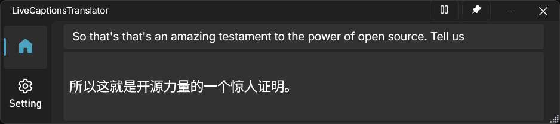
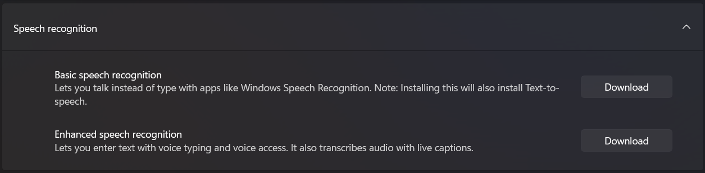

# LiveCaptions Translator     

***LiveCaptions Translator = Windows LiveCaptions + Translate API***

A small and useful tool that integrate a translate API into Windows Live Captions to enable real-time speech translation, even without Copilot+ PC.

Download it from the [Releases](https://github.com/SakiRinn/LiveCaptions-Translator/releases), and it's ready to use with just a click.

## Features

+ Automatically invoke Windows LiveCaptions without opening two windows.
+ Simple and beautiful Fluent UI.
+ Switch bright and dark theme automatically. (Follow system theme)
+ Currently supports Ollama, OpenAI like API, OpenRouter, and Google Translate. You are welcomed to implement more apis.
+ Buttons to keep the window on top and pause translation, translation-only mode, transparent mode.
+ Record what have been translated through Live Captions.
+ Copy the translated text with a click.

## Prerequisite

This tool is based on Windows LiveCaptions, which is available since Windows 11 22H2.

We suggest you have .NET runtime 8.0 or higher installed. If you are not available to install one, you can download the `with runtime` version but its size is bigger.

Read the  before getting started.

## Before your first running

> ***Importantly:*** *You must complete the following step before running LiveCaption Translator firstly*.
> 
> For more detailed information, see [Use live captions to better understand audio](https://support.microsoft.com/en-us/windows/use-live-captions-to-better-understand-audio-b52da59c-14b8-4031-aeeb-f6a47e6055df).

If your Windows version is proper, you can confirm whether Windows LiveCaptions is available by doing one of the following:

+ Turn on **Live captions** in the quick settings.
+ Turn on the **Live captions** toggle in the quick settings **Accessibility** flyout.
+ Press **Win + Ctrl + L**.
+ Select **Start** > **All apps** > **Accessibility** > **Live captions**.
+ Go to **Settings** > **Accessibility** > **Captions** and turn on the **Live captions** toggle.

When you start for the first time, live captions will ask for your consent to process voice data on your device and prompt you to download language files to be used by on-device speech recognition.

After launching Windows LiveCaptions, you can click the **⚙️gear** icon to open the setting menu.

To enhance your experience with LiveCaptions Translator, we strongly recommend configuring the following settings:

+ Select **Position** > **Overlaid on screen**. *(Importantly)*
+ Click **Caption language** > **Add a language** to add some languages and download all items under **Speech Recognition** in **··· Language options**.

Now, close Windows LiveCaptions and open LiveCaptions Translator to start using it!

## Star History

