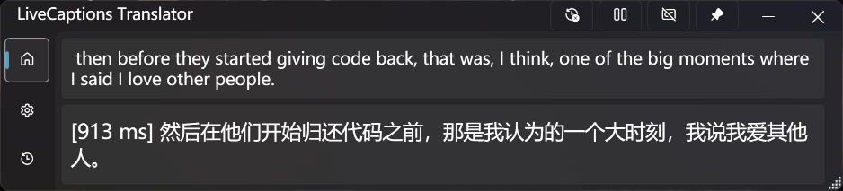
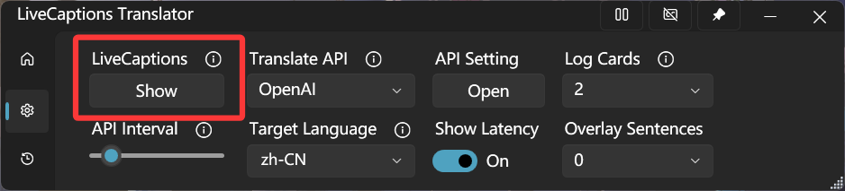
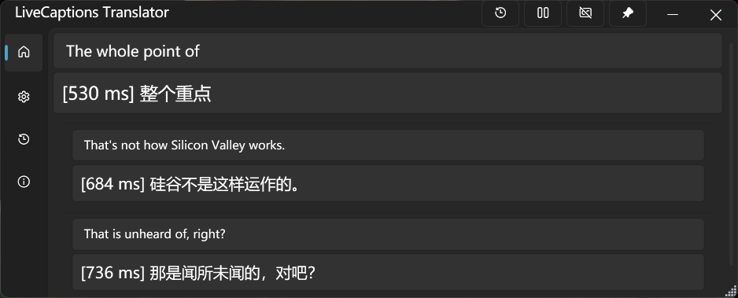

# LiveCaptions Translator

### *基于Windows LiveCaptions的实时音频/语音翻译工具*

[English](README.md) | **中文**

## 概述

**✨ LiveCaptions Translator = Windows LiveCaptions + 翻译API ✨**

这是一个无缝集成翻译API与Windows LiveCaptions的轻量级工具。它可以实现实时语音翻译，无需Copilot+ PC。

Windows内置的实时字幕简单易用，资源占用少，且识别准确率极高。如果为其赋能LLM强大的翻译能力，你将获得...可能是目前最好的实时翻译器！

**🚀 快速开始:** 从[发布页面](https://github.com/SakiRinn/LiveCaptions-Translator/releases)下载并一键启动！

  
   
  <em style="font-size:80%">LiveCaptions Translator预览</em>
   

## 功能特性

- **🔄 无缝集成** \
  自动调用Windows LiveCaptions而无需打开单独窗口。为实时音频/语音翻译提供统一体验。
  首次使用后，Windows LiveCaptions默认将被隐藏。您可以在设置中再次显示它。

  

  
   
  <em style="font-size:80%">实时字幕显示/隐藏按钮</em>
   
  

  通过在Windows LiveCaptions设置中启用 ***包含麦克风音频*** 选项，您可以实现实时语音翻译！
  > ⚠️ **重要:** 您必须在Windows LiveCaptions中更改源语言！

- **🎨 现代化界面** \
  易于使用且简洁的Fluent UI与现代Windows美学保持一致。它可以根据系统设置自动在浅色和深色主题🌓之间切换。

- **🌐 多种翻译服务** \
  支持各种翻译引擎，包括2个开箱即用的谷歌翻译。
  已实现的翻译引擎如下表所示：

  

  | API                                 | 类型        | 托管方式     |
  | ----------------------------------- | ----------- | ----------- |
  | [Ollama](https://ollama.com)        | 基于LLM     | 自托管      |
  | OpenAI兼容API                       | 基于LLM     | 在线        |
  | [OpenRouter](https://openrouter.ai) | 基于LLM     | 在线        |
  | 谷歌翻译                            | 传统翻译    | 在线        |
  | DeepL                               | 传统翻译    | 在线        |
  | 有道翻译                            | 传统翻译    | 在线        |
  | 百度翻译                            | 传统翻译    | 在线        |
  | MTranServer                         | 传统翻译    | 自托管      |

  

  强烈推荐使用 **基于LLM** 的翻译引擎，因为LLM擅长处理不完整的句子并能很好地理解上下文。

- **🪟 悬浮窗口** \
  打开无边框、透明的悬浮窗口显示字幕，提供最沉浸式的体验。这对游戏、视频和直播等场景非常有用！
  您甚至可以使其完全嵌入到屏幕中，成为屏幕的一部分。这意味着它不会影响您的任何操作！这对游戏玩家来说再合适不过了。

  

  
   
  <em style="font-size:80%">悬浮窗口</em>
   
  

  您可以在任务栏上打开悬浮窗口。您可以调整其参数，如窗口背景和字幕颜色、字体大小和透明度。极高的可配置性使其能够完全符合您的偏好！
  您可以在设置页的 *Overlay Sentences* 选项调整同时显示的句子数量。

- **⚙️ 灵活控制** \
  支持窗口置顶和便利的翻译暂停/恢复，并且您可以一键复制文本以便快速分享或保存。

- **📒 历史记录管理** \
  记录原文和翻译文本，非常适合会议、讲座和重要讨论。
  您可以将所有记录导出为CSV文件。

  

  
   
  <em style="font-size:80%">翻译历史</em>
   
  

- **🎞️ 日志卡片** \
  最近的转录记录可以显示为日志卡片，这有助于您更好地把握上下文。
  您可以在主页任务栏上启用它，并在设置页的 *Log Cards* 选项调整卡片数量。

  

  
   
  <em style="font-size:80%">日志卡片</em>
   
  

## 系统要求

| 要求                                                                                                               | 详情                            |
| ----------------------------------------------------------------------------------------------------------------- | ------------------------------- |
|  | 支持实时字幕功能                |
|            | 推荐。未在之前版本测试          |

本工具基于Windows LiveCaptions，该功能自Windows 11 22H2起可用。

我们建议您安装.NET运行时8.0或更高版本。如果您无法安装，可以下载 ***with runtime*** 版本，但其文件较大。

  

    
  

## 入门指南

> ⚠️ **重要:** 首次运行LiveCaptions Translator前，您必须完成以下步骤。
>
> 有关详细信息，请参阅Microsoft的[使用实时字幕](https://support.microsoft.com/zh-cn/windows/使用实时字幕更好地理解音频-b52da59c-14b8-4031-aeeb-f6a47e6055df)指南。

### 步骤1: 验证Windows LiveCaptions可用性

使用以下任一方法确认您的系统上可用实时字幕：

- 在快速设置中切换 **实时字幕**
- 按 **Win + Ctrl + L**
- 通过 **快速设置** > **辅助功能** > **实时字幕** 访问
- 打开 **开始** > **所有应用** > **辅助功能** > **实时字幕**
- 导航至 **设置** > **辅助功能** > **字幕**并启用 **实时字幕**

### 步骤2: 设置和配置实时字幕

首次启动时，实时字幕会请求您同意在设备上处理语音数据，并提示您下载用于设备上语音识别的语言文件。

启动Windows LiveCaptions后，您可以点击**⚙️齿轮**图标打开设置菜单。

为了增强LiveCaptions Translator的体验，我们强烈建议配置以下设置：

- 选择位置 > 覆盖在屏幕上。（重要）
- 点击字幕语言 > 添加语言来添加一些语言，并在···语言选项下的语音识别中下载所有项目。

  
   
  <em style="font-size:80%">需要下载的语音识别组件</em>
   

配置完成后，关闭Windows LiveCaptions并启动LiveCaptions Translator开始使用！🎉

## 项目统计

### 活动

  
  
  
  

### 贡献者

  
   
  

### Star历史

